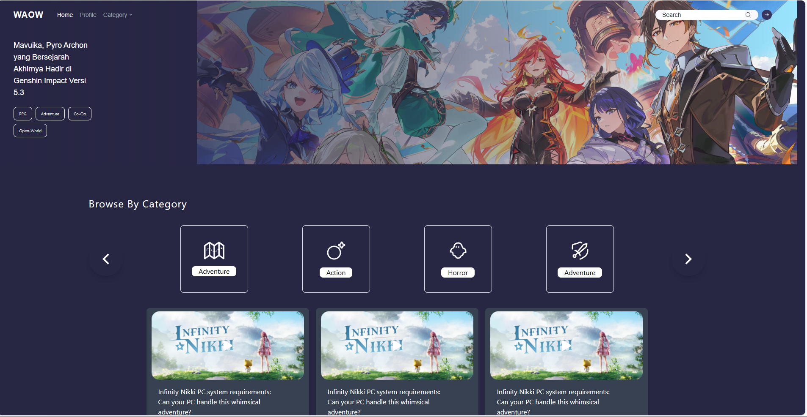
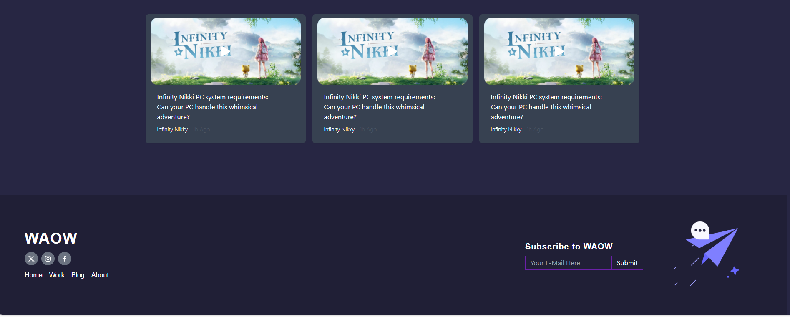
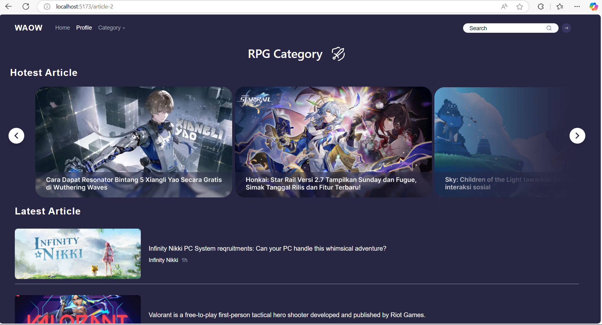
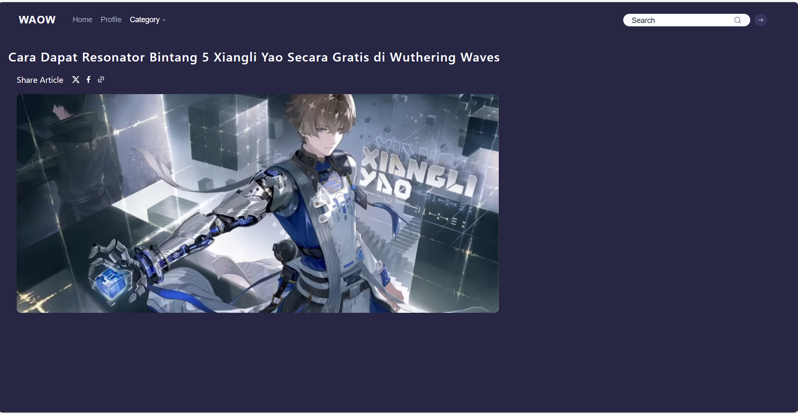

# React Slicing Project

 
Halo! Saya Achmad Michael Mushoharoin telah mengumpulkan tugas tambahan point slicing dengan menggunakan React. Proyek ini dibuat menggunakan React versi 18, Tailwind CSS, dan React Icons.

## Daftar Halaman

1. [Article-1](/article-1)
2. [Article-2](/article-2)
3. [Article-3](/article-3)

## Article-1

Halaman article pertama

## Article-2

Halaman article kedua

## Article-3

Halaman article ketiga

## Catatan Pengerjaan

Proyek ini saya kerjakan hanya seadanya dan tanpa mempertimbangkan desain responsif karena waktu yang mepet. Saya fokus pada tampilan dasar dan fungsionalitas minimal.

## Teknologi yang Digunakan

- React 18
- Tailwind CSS
- React Icons
